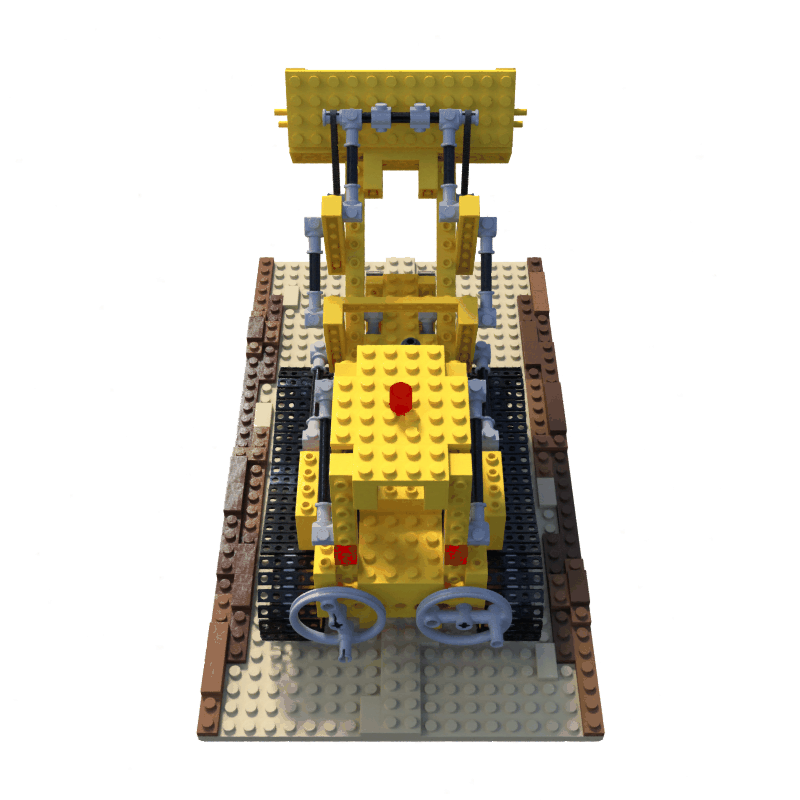
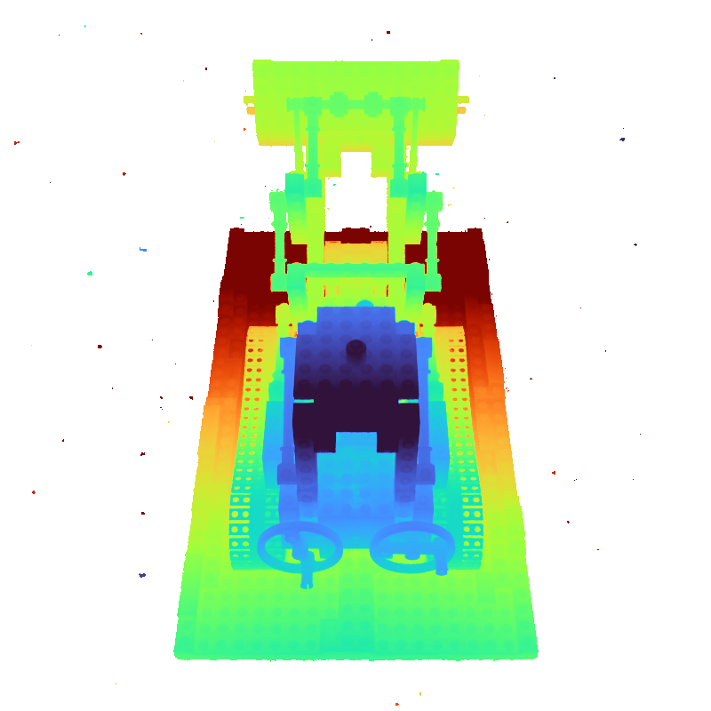
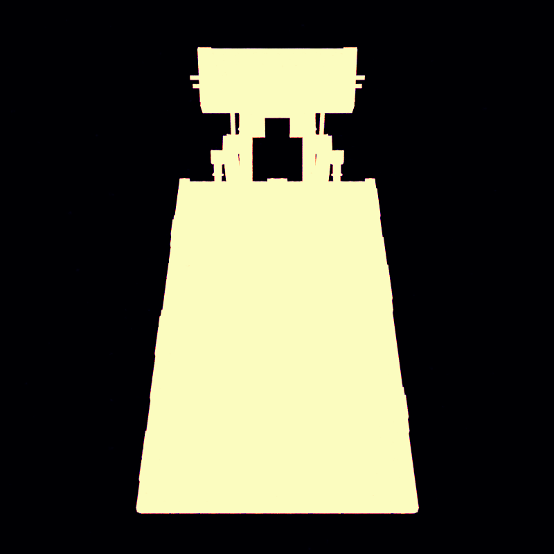
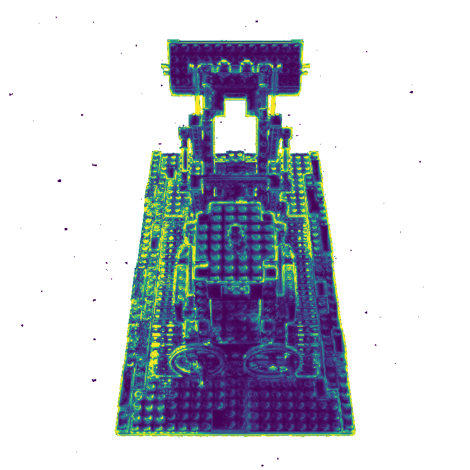
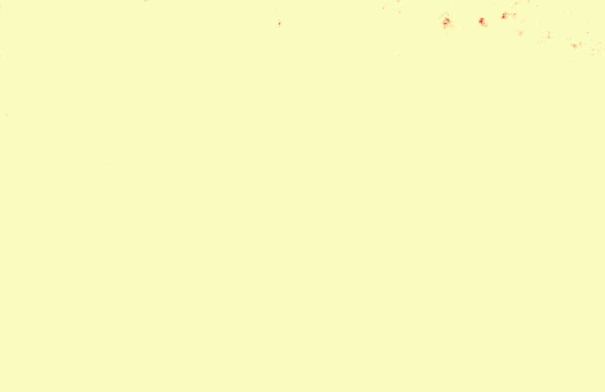

# GS-NeRF

**Work in progress.** Depth/opacity/frequency–guided NeRF training: a 2D oracle restricts ray sampling to `[D−Δ, D+Δ]`, skips low-opacity rays, and optionally adapts the march step from a frequency map. Today the oracle is **baked** from a pretrained NeRF; the intended producer is a frozen **3D Gaussian Splatting** warm-up.

Built on [NerfAcc](https://github.com/nerfstudio-project/nerfacc) (`OccGridEstimator` + volumetric rendering).

## Oracle trainers

| Script                                                                                       | Field       | Notes                     |
| -------------------------------------------------------------------------------------------- | ----------- | ------------------------- |
| `[examples/train_mlp_nerf_depth_oracle.py](examples/train_mlp_nerf_depth_oracle.py)`         | Vanilla MLP | Synthetic scenes          |
| `[examples/train_ngp_nerf_occ_depth_oracle.py](examples/train_ngp_nerf_occ_depth_oracle.py)` | Instant-NGP | Synthetic or Mip-NeRF 360 |

Both run in **oracle only** mode (OccGrid held all-occupied; sampling driven by the oracle). Bake maps with `examples/bake_mlp_depth_oracle.py` / `examples/bake_ngp_depth_oracle.py`. See `[docs/training_flows/depth_oracle_ablation.md](docs/training_flows/depth_oracle_ablation.md)` for commands.

Baseline (no oracle): `train_mlp_nerf.py`, `train_ngp_nerf_occ.py`.

## Results

Oracle visualizations (RGB / depth / opacity / frequency) for **Lego** (synthetic NGP) and **Garden** (Mip-NeRF 360).

### Lego

<table align="center">
  <tr>
    <td align="center" width="25%"></td>
    <td align="center" width="25%"></td>
    <td align="center" width="25%"></td>
    <td align="center" width="25%"></td>
  </tr>
  <tr>
    <td align="center"><b>RGB</b></td>
    <td align="center"><b>Depth</b></td>
    <td align="center"><b>Opacity</b></td>
    <td align="center"><b>Frequency</b></td>
  </tr>
</table>

### Garden

<table align="center">
  <tr>
    <td align="center" width="25%"></td>
    <td align="center" width="25%"></td>
    <td align="center" width="25%"></td>
    <td align="center" width="25%"></td>
  </tr>
  <tr>
    <td align="center"><b>RGB</b></td>
    <td align="center"><b>Depth</b></td>
    <td align="center"><b>Opacity</b></td>
    <td align="center"><b>Frequency</b></td>
  </tr>
</table>

## Status

Early prototype — APIs, defaults, and the 3DGS oracle path are not finalized.

## Credits & license

This repository is derived from **[NerfAcc](https://github.com/nerfstudio-project/nerfacc)** (MIT), Copyright (c) 2022 [Ruilong Li](https://www.liruilong.cn/) / [nerfstudio-project](https://github.com/nerfstudio-project).

GS-NeRF adds the depth-oracle trainers, bake utilities, and related experiment docs. The project remains under the **MIT License** — see `[LICENSE](LICENSE)`. Please retain the original NerfAcc copyright notice when redistributing.