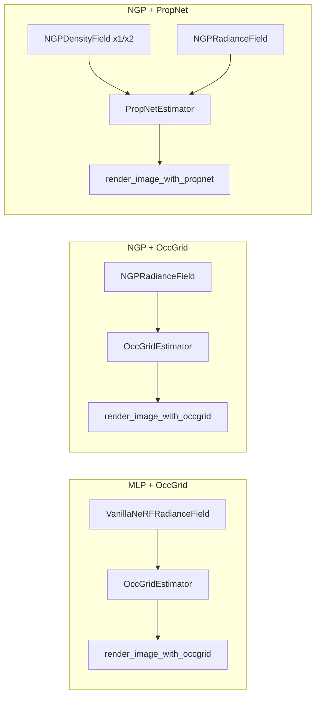

# Comparing the three NeRF training examples

Side-by-side guide to:

- `examples/train_mlp_nerf.py`
- `examples/train_ngp_nerf_occ.py`
- `examples/train_ngp_nerf_prop.py`

Detailed per-script walkthroughs:

- [train_mlp_nerf.md](train_mlp_nerf.md)
- [train_ngp_nerf_occ.md](train_ngp_nerf_occ.md)
- [train_ngp_nerf_prop.md](train_ngp_nerf_prop.md)

---

## One-line summary

| Script | Scene model | How samples are chosen |
|--------|-------------|------------------------|
| **MLP + Occ** | Classic PE MLP | Occupancy grid skips empty voxels |
| **NGP + Occ** | Instant-NGP hash grid | Same occupancy-grid skipping |
| **NGP + Prop** | Instant-NGP hash grid | Learned proposal nets importance-sample along rays |

MLP vs NGP is about **representation**. Occ vs Prop is about **sampling / acceleration**.

---

## Architecture comparison



---

## Feature matrix

| Feature | MLP Occ | NGP Occ | NGP Prop |
|---------|---------|---------|----------|
| Radiance field | `VanillaNeRFRadianceField` | `NGPRadianceField` | `NGPRadianceField` |
| Encoding | Sinusoidal PE | HashGrid (tcnn) | HashGrid (tcnn) |
| Estimator | `OccGridEstimator` | `OccGridEstimator` / VDB | `PropNetEstimator` |
| Extra networks | — | — | 1–2× `NGPDensityField` |
| Render helper | `render_image_with_occgrid` | same (+ optional `_test`) | `render_image_with_propnet` |
| Sample layout | Packed variable | Packed variable | Dense fixed `[rays, S]` |
| Empty-space skip | Explicit binary grid | Explicit binary grid | Via proposal PDF |
| Proposal / PDF loss | No | No | Yes |
| Dynamic `num_rays` | Yes (`2^16` target) | Yes (`2^18` target) | No (fixed 4096) |
| GradScaler | No | Yes | Yes |
| Unbounded 360 support | No | Yes (cascades + cone) | Yes (lindisp + 2 props) |
| Default steps | 10 000 | 20 000 | 20 000 |
| Default LR | `5e-4` | `1e-2` + warm-up | `1e-2` + warm-up (RF & props) |
| Checkpoint save | Yes | No | No |
| Photometric loss | `smooth_l1` | `smooth_l1` | `smooth_l1` |
| Eval metrics | PSNR + LPIPS | PSNR + LPIPS | PSNR + LPIPS |

---

## Training-step comparison

### Shared skeleton

All three:

1. Draw a random training batch of rays / pixels / background  
2. Render RGB (and aux)  
3. `smooth_l1` vs pixels  
4. Optimize the radiance field  
5. Periodically log PSNR; at the end evaluate test views  

### Where they diverge

| Step | OccGrid methods | PropNet method |
|------|-----------------|----------------|
| Before render | `estimator.update_every_n_steps(occ_eval_fn)` — refresh occupancy from density | Decide `proposal_requires_grad` |
| During render | March occupied cells; variable samples | Hierarchical importance sampling; fixed samples |
| After render | Resize `num_rays` from `n_rendering_samples` | `estimator.update_every_n_steps(extras["trans"], ...)` — PDF loss on proposals |
| Backward | Only radiance field | Radiance field every step; proposals only on schedule |

---

## Sampling & rendering logic

### Occupancy grid (`render_image_with_occgrid`)

1. Intersect rays with AABB(s)  
2. Traverse **occupied** voxels only → candidate intervals  
3. Optional `sigma_fn` filters nearly invisible intervals  
4. Evaluate full NeRF on survivors (`rgb_sigma_fn`)  
5. Classical volume rendering with packed `ray_indices`  

**Strengths:** Strong empty-space skipping; sample count adapts to scene occupancy.  
**Costs:** Grid update overhead; resolution / levels must cover the scene; less natural for very large unbounded volumes without cascades.

### Proposal net (`render_image_with_propnet`)

1. Start from uniform (or lindisp) bins  
2. Each proposal net evaluates density → transmittance → CDF  
3. Resample finer bins from that CDF  
4. Final bins evaluated by the real NeRF  
5. Volume rendering on dense tensors; train proposals so their CDFs match NeRF weights  

**Strengths:** No discrete occupancy resolution; works well with contraction / unbounded rays; sample budget is predictable.  
**Costs:** Extra networks + PDF loss; always evaluates a fixed number of samples even in empty regions (though proposals learn to concentrate them).

---

## Hyperparameter intuition (synthetic “lego”-style)

| Knob | MLP Occ | NGP Occ | NGP Prop |
|------|---------|---------|----------|
| Rays / step (start) | 1024 | 1024 | 4096 |
| Effective 3D samples | ~65k (adaptive) | ~262k (adaptive) | `4096 × 64` final (+ proposal samples) |
| Near / far | `0` / `1e10` (grid clips) | same | `2` / `6` (explicit) |
| Step / sample control | `render_step_size=5e-3` | same | `num_samples=64`, prop `[128]` |

OccGrid uses **step size** along the ray; PropNet uses **counts** of stratified / importance samples between near and far.

---

## When to use which

| Goal | Prefer |
|------|--------|
| Understand classic NeRF + nerfacc occupancy API | **MLP Occ** |
| Fast high-quality Instant-NGP on bounded or 360 with grid skipping | **NGP Occ** |
| Mip-NeRF 360–style hierarchical sampling / proposal training | **NGP Prop** |
| Predictable memory (fixed samples per ray) | **NGP Prop** |
| Maximize skipping of empty space with a spatial structure | **Occ** variants |

---

## Evaluation comparison

All three:

- Switch models to `eval()`  
- Render full test images (chunked)  
- Report mean **PSNR** and **LPIPS (VGG)**  
- Save `rgb_test.png` and `rgb_error.png` for the first test view  

Differences:

| | MLP Occ | NGP Occ | NGP Prop |
|--|---------|---------|----------|
| Chunk size CLI | `--test_chunk_size` (4096) | function default 8192 | `--test_chunk_size` (8192) |
| Occupancy / proposals at test | Frozen binaries | Frozen binaries | Proposals still guide sampling (no PDF update) |
| Full test set | Yes | Yes | Code currently `break`s after first image |

---

## Shared utilities worth knowing

| Symbol | Location | Used by |
|--------|----------|---------|
| `render_image_with_occgrid` | `examples/utils.py` | MLP Occ, NGP Occ |
| `render_image_with_occgrid_test` | `examples/utils.py` | NGP Occ (optional / commented) |
| `render_image_with_propnet` | `examples/utils.py` | NGP Prop |
| `OccGridEstimator` | `nerfacc/estimators/occ_grid.py` | MLP Occ, NGP Occ |
| `PropNetEstimator` | `nerfacc/estimators/prop_net.py` | NGP Prop |
| `SubjectLoader` | `examples/datasets/...` | all |
| `Rays` | `examples/datasets/utils.py` | all |

---

## Mental model

```
                    ┌── Vanilla MLP ──────── train_mlp_nerf.py
 Scene representation
                    └── Instant-NGP ──┬──── train_ngp_nerf_occ.py
                                      └──── train_ngp_nerf_prop.py

                    ┌── Occupancy grid ───── *_occ / mlp_nerf
 Sample acceleration
                    └── Proposal networks ── train_ngp_nerf_prop.py
```

Read the OccGrid docs first if you are new to nerfacc: both MLP and NGP Occ share one render path. Then read the PropNet doc to see how hierarchical sampling replaces the grid with learned PDFs and a second loss.
