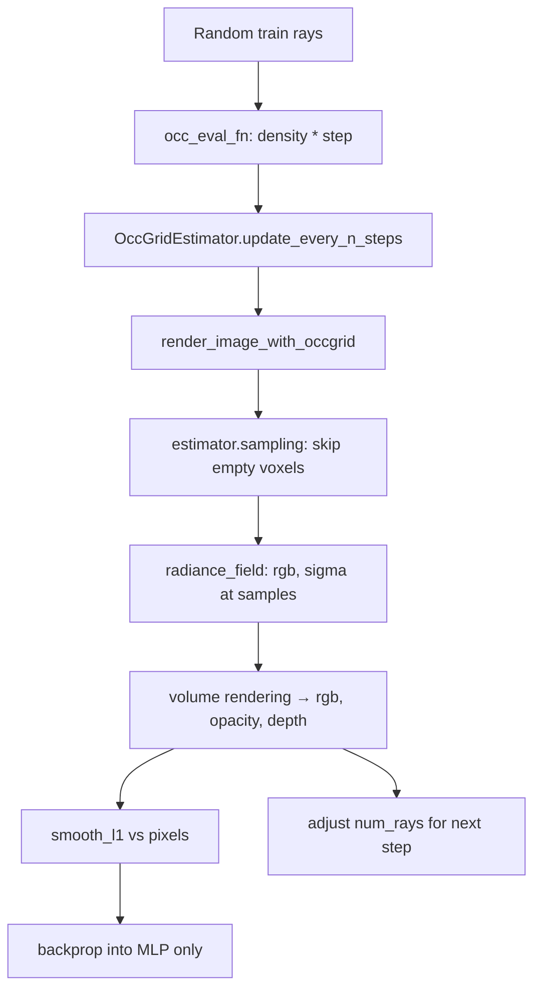

# `train_mlp_nerf.py` — Vanilla MLP NeRF + Occupancy Grid

This script trains a classic positional-encoding MLP NeRF (`VanillaNeRFRadianceField`) and accelerates ray marching with an **occupancy grid** (`OccGridEstimator`). It is the slowest / most “textbook” of the three examples, but the rendering pipeline is the same occupancy-grid path used by `train_ngp_nerf_occ.py`.

**Core idea:** maintain a coarse 3D binary grid of “occupied” voxels. When casting rays, only sample inside occupied cells (plus optional density-based early stopping). Empty space is skipped.

---

## High-level components

| Component | Class / function | Role |
|-----------|------------------|------|
| Radiance field | `VanillaNeRFRadianceField` | Maps `(x, viewdir) → (rgb, σ)` via PE + MLP |
| Estimator | `OccGridEstimator` | Binary occupancy grid; samples along rays |
| Renderer | `render_image_with_occgrid` | Ray march + volume render |
| Data | `SubjectLoader` (NeRF Synthetic) | Rays + pixels for train/test |
| Loss | `F.smooth_l1_loss(rgb, pixels)` | Photometric supervision |

---

## Setup (before the training loop)

### CLI / hyperparameters

| Name | Default | Meaning |
|------|---------|---------|
| `--data_root` | `data/nerf_synthetic` | Dataset root |
| `--scene` | `lego` | Scene name |
| `--train_split` | `train` | `train` or `trainval` |
| `--model_path` | `None` | Optional checkpoint to resume |
| `--test_chunk_size` | `4096` | Rays per chunk at eval |
| `max_steps` | `10000` | Training iterations |
| `init_batch_size` | `1024` | Initial number of rays / step |
| `target_sample_batch_size` | `2^16` | Target # of 3D samples / step (dynamic ray count) |
| `aabb` | `[-1.5]^3 … [1.5]^3` | Scene bounding box |
| `grid_resolution` | `128` | Occupancy grid resolution |
| `grid_nlvl` | `1` | Number of grid levels (1 for bounded synthetic) |
| `render_step_size` | `5e-3` | Step size along ray during marching |

### Dataset

```python
train_dataset = SubjectLoader(..., num_rays=init_batch_size, ...)  # random ray batches
test_dataset  = SubjectLoader(..., num_rays=None, ...)             # full images
```

Each `__getitem__` returns a dict:

- `rays`: `Rays(origins, viewdirs)` — shape `[N, 3]` (train) or `[H, W, 3]` (test)
- `pixels`: RGB targets `[N, 3]` or `[H, W, 3]`
- `color_bkgd`: background color used in compositing

Training samples a **random image index** each step (`torch.randint`), then the loader samples `num_rays` random pixels across images.

### Models & optimizer

```python
estimator = OccGridEstimator(roi_aabb=aabb, resolution=128, levels=1)
radiance_field = VanillaNeRFRadianceField()  # PE(pos 0..10) + PE(dir 0..4) + NerfMLP
optimizer = Adam(lr=5e-4)
scheduler = MultiStepLR(... gamma=0.33 at 50%, 75%, ~83%, 90% of max_steps)
```

Optional checkpoint restore loads radiance field, optimizer, scheduler, and estimator state.

---

## Radiance field: `VanillaNeRFRadianceField`

Defined in `examples/radiance_fields/mlp.py`.

### `query_density(x) → σ`

| | |
|--|--|
| **Input** | `x`: positions `[..., 3]` |
| **Logic** | Encode `x` with `SinusoidalEncoder(3, 0, 10)`, run density branch of `NerfMLP`, apply `ReLU` |
| **Output** | Density `σ` `[..., 1]` |

Used by the occupancy-grid updater and by `sigma_fn` inside the renderer (visibility / early-stop filtering).

### `forward(x, condition=None) → (rgb, σ)`

| | |
|--|--|
| **Input** | `x`: positions; `condition`: view directions (optional) |
| **Logic** | PE on position (+ PE on direction if given) → `NerfMLP` → `sigmoid(rgb)`, `ReLU(σ)` |
| **Output** | `rgb` `[..., 3]`, `σ` `[..., 1]` |

---

## Estimator: `OccGridEstimator`

Defined in `nerfacc/estimators/occ_grid.py`.

Stores:

- `occs`: continuous occupancy values (EMA-updated)
- `binaries`: boolean occupied/empty voxels used for skipping
- `aabbs`: one AABB per level (level `i` enlarges the ROI by `2^i`)

### `update_every_n_steps(step, occ_eval_fn, occ_thre=1e-2, n=16)`

| | |
|--|--|
| **Input** | Current step; `occ_eval_fn(x) → occupancy` at sample points `x`; threshold |
| **When** | Every `n=16` steps while `training=True` |
| **Logic** | Evaluate density-based occupancy on grid cells (all cells during warmup, then mix of random + occupied). EMA-update `occs`, binarize with `occ_thre` into `binaries` |
| **Output** | `None` (updates buffers in-place) |

In the script:

```python
def occ_eval_fn(x):
    density = radiance_field.query_density(x)
    return density * render_step_size  # ≈ opacity for one step
```

### `sampling(rays_o, rays_d, sigma_fn=..., ...) → (ray_indices, t_starts, t_ends)`

| | |
|--|--|
| **Input** | Ray origins/directions; optional `sigma_fn` for fine visibility filtering; near/far; step size; stratified flag; cone angle; alpha threshold |
| **Logic** | Traverse only occupied voxels (`traverse_grids`), produce intervals. Optionally filter intervals with `sigma_fn` / early stopping so nearly transparent samples are dropped |
| **Output** | Packed samples: `ray_indices[N]`, `t_starts[N]`, `t_ends[N]` (variable samples per ray) |
| **Note** | **Not differentiable** (`@torch.no_grad()`). Gradients flow only through the radiance field evaluated at those samples |

---

## Renderer: `render_image_with_occgrid`

Defined in `examples/utils.py`. This is the main render path for both train and eval in this script.

### Signature (inputs)

| Arg | Type | Role |
|-----|------|------|
| `radiance_field` | `nn.Module` | Provides `query_density` and `forward` |
| `estimator` | `OccGridEstimator` | Provides `sampling` |
| `rays` | `Rays` | Origins + viewdirs, `[N,3]` or `[H,W,3]` |
| `near_plane`, `far_plane` | float | Ray bounds |
| `render_step_size` | float | Marching step |
| `render_bkgd` | Tensor or None | Background RGB for compositing |
| `cone_angle` | float | `0` = constant step; `>0` = cone tracing (mip-NeRF360 style) |
| `alpha_thre` | float | Drop samples with alpha below threshold |
| `test_chunk_size` | int | Chunk size when `radiance_field.training` is False |
| `timestamps` | optional | For dynamic NeRF (unused here) |

### Outputs

| Return | Shape / type | Meaning |
|--------|--------------|---------|
| `colors` | same spatial shape as rays + `3` | Rendered RGB |
| `opacities` | `... × 1` | Accumulated opacity (alpha) |
| `depths` | `... × 1` | Expected depth |
| `n_rendering_samples` | `int` | Total number of intervals sampled (all chunks) |

### Internal logic (step by step)

```
1. Flatten rays if image-shaped [H,W,3] → [H*W,3]
2. Choose chunk size:
     - training: one huge chunk (all rays)
     - eval:     test_chunk_size
3. For each chunk:
   a. Define sigma_fn(t_starts, t_ends, ray_indices):
        midpoints = o + d * (t_starts+t_ends)/2
        return radiance_field.query_density(midpoints)
      → used by estimator for visibility filtering

   b. Define rgb_sigma_fn(t_starts, t_ends, ray_indices):
        midpoints = ...
        return radiance_field(midpoints, dirs)  → (rgb, σ)
      → used by volume rendering

   c. ray_indices, t_starts, t_ends = estimator.sampling(
          rays_o, rays_d, sigma_fn=sigma_fn,
          stratified=training, ...)

   d. rgb, opacity, depth, extras = rendering(
          t_starts, t_ends, ray_indices,
          rgb_sigma_fn=rgb_sigma_fn, render_bkgd=...)
      → classical volume rendering:
         α_i = 1 - exp(-σ_i Δt_i)
         T_i = ∏(1-α_j),  w_i = T_i α_i
         C = Σ w_i c_i + (1-Σw) * bkgd

4. Concatenate chunk results, reshape to original ray layout
```

---

## Training loop flow

```
for step in 0 … max_steps:
  1. Sample random training batch (rays, pixels, bkgd)
  2. Update occupancy grid (every 16 steps via update_every_n_steps)
  3. Render: rgb, acc, depth, n_samples = render_image_with_occgrid(...)
  4. If n_samples == 0: skip step (empty grid early in training)
  5. Dynamic batch size:
       num_rays ← num_rays * (target_sample_batch_size / n_samples)
       train_dataset.update_num_rays(num_rays)
     → keeps ~65k samples/step even as the scene gets denser/sparser
  6. loss = smooth_l1(rgb, pixels)
  7. Adam step + LR schedule
  8. Every 50 steps: log MSE-PSNR, sample count, num_rays
  9. At step == max_steps: save checkpoint + run evaluation
```

### Dynamic ray batch (important)

Occupancy skipping means the number of 3D samples is **not** `num_rays × constant`. The script adjusts `num_rays` so that `n_rendering_samples ≈ target_sample_batch_size`. That stabilizes memory and effective compute per step.

---

## Evaluation flow

Triggered when `step > 0 and step % max_steps == 0` (i.e. the final step).

```
1. radiance_field.eval(); estimator.eval()
2. For each test image i:
     - Full-image rays [H,W,3]
     - render_image_with_occgrid(..., test_chunk_size=4096)
     - PSNR from MSE(rgb, pixels)
     - LPIPS (VGG) after remapping to [-1,1] NCHW
     - For i==0: write rgb_test.png and rgb_error.png
3. Print average PSNR and LPIPS
```

Differences vs training render:

- No occupancy updates
- No stratified sampling (`stratified=False` because `training=False`)
- Rays are chunked (`test_chunk_size`) to limit peak memory
- Full images, not random ray subsets

Also saves a checkpoint dict: step, radiance field, optimizer, scheduler, estimator.

---

## End-to-end diagram



Gradients do **not** flow into the occupancy grid. The grid is a non-differentiable acceleration structure updated from the current density field.
