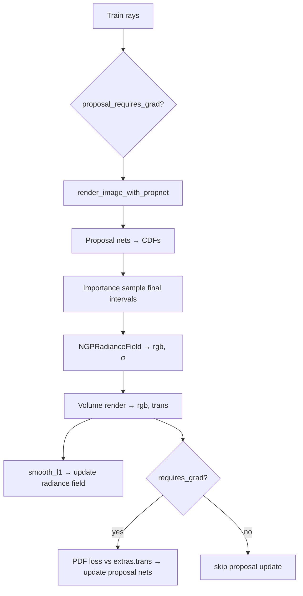

# `train_ngp_nerf_prop.py` — Instant-NGP + Proposal Networks

This script trains an Instant-NGP radiance field with **proposal-network** sampling (`PropNetEstimator`), following the Mip-NeRF 360 hierarchical sampling idea. Instead of a binary occupancy grid that skips empty space, learned density networks propose where along each ray to place samples.

**Core idea:** cheap proposal MLPs predict a coarse density / transmittance PDF along the ray; samples for the real radiance field are drawn from that PDF (importance sampling). Proposal nets are trained so their PDF upper-bounds / matches the true weight distribution (PDF loss).

---

## High-level components

| Component | Class / function | Role |
|-----------|------------------|------|
| Radiance field | `NGPRadianceField` | Final hash-grid NeRF `(rgb, σ)` |
| Proposal nets | `NGPDensityField` (1 or 2) | Coarse density-only hash grids |
| Estimator | `PropNetEstimator` | Hierarchical importance sampling + PDF loss |
| Renderer | `render_image_with_propnet` | Proposal sampling + volume render |
| Data | `SubjectLoader` | Synthetic or 360 |
| Losses | Photometric `smooth_l1` + proposal PDF loss | RF + proposal training |

There is **no occupancy grid** and **no dynamic `num_rays`** adjustment — each ray always gets a fixed number of samples.

---

## Scene-dependent configuration

### NeRF Synthetic (bounded)

| Setting | Value |
|---------|-------|
| `max_steps` | 20 000 |
| `init_batch_size` | 4096 rays |
| `unbounded` | `False` |
| `aabb` | `[-1.5, 1.5]^3` |
| `near_plane` / `far_plane` | `2.0` / `6.0` (tight bounds) |
| Proposal nets | **1×** `NGPDensityField` (5 levels, max_res 128) |
| `num_samples_per_prop` | `[128]` |
| `num_samples` | `64` (final samples for radiance field) |
| `sampling_type` | `"uniform"` |
| `opaque_bkgd` | `False` |

### Mip-NeRF 360 (unbounded)

| Setting | Value |
|---------|-------|
| `near_plane` / `far_plane` | `0.2` / `1e3` |
| Proposal nets | **2×** `NGPDensityField` (max_res 128 then 256) |
| `num_samples_per_prop` | `[256, 96]` |
| `num_samples` | `48` |
| `sampling_type` | `"lindisp"` (inverse-depth / disparity) |
| `opaque_bkgd` | `True` (last sample forced to infinite density) |
| Dataset | `factor=4`, random background |

Hierarchy for 360: coarse proposal (256 samples) → finer proposal (96) → final NeRF (48).

---

## Setup

### Proposal networks + their optimizer

```python
proposal_networks = [NGPDensityField(...), ...]  # 1 or 2 nets

prop_optimizer = Adam(all proposal params, lr=1e-2, ...)
prop_scheduler = ChainedScheduler([LinearLR warm-up, MultiStepLR])
estimator = PropNetEstimator(prop_optimizer, prop_scheduler)
```

`PropNetEstimator` **owns** the proposal optimizer/scheduler. Updating proposals happens inside `estimator.update_every_n_steps`, not in the main Adam loop.

### Radiance field optimizer (separate)

```python
radiance_field = NGPRadianceField(aabb=aabb, unbounded=unbounded)
optimizer = Adam(radiance_field.parameters(), lr=1e-2, ...)
scheduler = ChainedScheduler([...])  # same schedule shape
grad_scaler = GradScaler(2**10)
```

### Proposal grad schedule

```python
proposal_requires_grad_fn = get_proposal_requires_grad_fn()
# returns True only every so often; frequency ramps from rare → ~every 5 steps
```

`get_proposal_requires_grad_fn(target=5.0, num_steps=1000)`:

- Tracks steps since last proposal update
- Target interval grows from 0 to `target=5` over the first 1000 steps
- Returns `True` when enough steps have passed → that iteration runs proposal forward **with grads**, then PDF loss update

This avoids updating proposals every step (expensive / noisy early on).

---

## Models

### `NGPRadianceField`

Same as in the OccGrid NGP script (hash grid + RGB head). See [`train_ngp_nerf_occ.md`](train_ngp_nerf_occ.md).

### `NGPDensityField`

Density-only Instant-NGP (no view-dependent RGB).

| Method | I/O |
|--------|-----|
| `forward(positions)` | `[..., 3]` → density `[..., 1]` via HashGrid + tiny MLP + `trunc_exp` |

Used only as proposal / resampling networks.

---

## Estimator: `PropNetEstimator`

Defined in `nerfacc/estimators/prop_net.py`.

### `sampling(...) → (t_starts, t_ends)`

| Arg | Role |
|-----|------|
| `prop_sigma_fns` | List of callables `(t_starts, t_ends) → σ` for each proposal net |
| `prop_samples` | Samples drawn at each proposal level |
| `num_samples` | Final sample count for the NeRF |
| `n_rays` | Batch size |
| `near_plane`, `far_plane` | Ray bounds |
| `sampling_type` | `"uniform"` or `"lindisp"` maps normalized `s ∈ [0,1]` ↔ `t` |
| `stratified` | Jitter bins during training |
| `requires_grad` | If True, cache proposal CDFs for later PDF loss |

**Logic:**

```
cdfs = [0, 1] on each ray   # initially uniform in normalized space
for each proposal level:
  importance_sample intervals from current cdfs  → prop_samples bins
  map s → t via uniform or lindisp
  σ = proposal_net(midpoints)
  transmittance T from σ
  cdfs = 1 - T           # new PDF for next level
  if requires_grad: cache (intervals, cdfs)

importance_sample final num_samples from last cdfs
return t_starts, t_ends   # shape [n_rays, num_samples]
```

Unlike OccGrid, outputs are **dense** (fixed samples per ray), not packed variable-length.

### `update_every_n_steps(trans, requires_grad, loss_scaler) → float`

| | |
|--|--|
| **Input** | `trans`: transmittance of **final** NeRF samples `[n_rays, num_samples]` from volume rendering extras; whether this step should train proposals; loss scale |
| **If `requires_grad`** | Compute PDF loss between proposal CDFs and detached NeRF CDFs (`1 - trans`); `backward` through proposal nets; step `prop_optimizer` / scheduler |
| **Else** | Optionally step scheduler only; return `0` |
| **Output** | Proposal loss value (float) for logging |

PDF loss (`_pdf_loss`): proposals should put at least as much mass as the true rendering weights (outer histogram bound), squared relative error.

---

## Renderer: `render_image_with_propnet`

Defined in `examples/utils.py`.

### Inputs

| Arg | Role |
|-----|------|
| `radiance_field` | Final NeRF |
| `proposal_networks` | Sequence of density fields |
| `estimator` | `PropNetEstimator` |
| `rays` | `Rays` `[N,3]` or `[H,W,3]` |
| `num_samples` | Final samples along ray |
| `num_samples_per_prop` | Samples per proposal stage |
| `near_plane`, `far_plane` | Bounds |
| `sampling_type` | `"uniform"` / `"lindisp"` |
| `opaque_bkgd` | Force last σ → ∞ (opaque background) |
| `render_bkgd` | Background RGB |
| `proposal_requires_grad` | Enable proposal caching / grads |
| `test_chunk_size` | Eval chunking |

### Outputs

| Return | Meaning |
|--------|---------|
| `colors` | RGB, reshaped to ray layout |
| `opacities` | Accumulated alpha |
| `depths` | Expected depth |
| `extras` | Dict from `rendering()`; training uses `extras["trans"]` for proposal update |

### Internal logic

```
1. Flatten image rays if needed
2. Define closures (closed over chunk_rays):

   prop_sigma_fn(t_starts, t_ends, proposal_network):
       positions = o + d * midpoint(t)
       σ = proposal_network(positions)
       if opaque_bkgd: σ[..., -1] = ∞
       return σ

   rgb_sigma_fn(t_starts, t_ends, ray_indices):
       # ray_indices unused — samples are dense [n_rays, S]
       positions = ...
       rgb, σ = radiance_field(positions, dirs)
       if opaque_bkgd: σ[..., -1] = ∞
       return rgb, σ

3. For each ray chunk:
     t_starts, t_ends = estimator.sampling(
         prop_sigma_fns=[λ for each proposal net],
         prop_samples=num_samples_per_prop,
         num_samples=num_samples,
         requires_grad=proposal_requires_grad,
         stratified=training, ...)
     rgb, opacity, depth, extras = rendering(
         t_starts, t_ends,
         ray_indices=None,   # dense layout
         rgb_sigma_fn=rgb_sigma_fn,
         render_bkgd=...)

4. Collate chunks; return colors, opacities, depths, extras
   (extras is from the *last* chunk — fine for train batches that are one chunk)
```

---

## Training loop flow

```
for step in 0 … max_steps:
  1. Sample train batch (4096 rays by default)
  2. proposal_requires_grad = proposal_requires_grad_fn(step)
  3. rgb, acc, depth, extras = render_image_with_propnet(
         ..., proposal_requires_grad=proposal_requires_grad)
  4. estimator.update_every_n_steps(
         extras["trans"], proposal_requires_grad, loss_scaler=1024)
       → may run PDF loss + prop_optimizer step
  5. loss = smooth_l1(rgb, pixels)   # radiance field only
  6. grad_scaler.scale(loss).backward()
     optimizer.step(); scheduler.step()
  7. Every 10_000 steps: log PSNR
  8. At final step: evaluate
```

### Two separate optimization paths

| Path | What is updated | When |
|------|-----------------|------|
| Photometric `smooth_l1` | `NGPRadianceField` | Every step |
| PDF loss via estimator | `NGPDensityField` proposal nets | Only when `proposal_requires_grad` is True |

Proposal sampling intervals themselves are under `@torch.no_grad()` for the CDF construction path except when `requires_grad` enables grads through proposal density evaluations used for the cached CDFs.

---

## Evaluation flow

```
1. eval() on radiance field, all proposal nets, estimator
2. For each test image (script currently breaks after i==0 — only first image):
     render_image_with_propnet(..., test_chunk_size=8192,
                               proposal_requires_grad defaults False)
     PSNR + LPIPS; save rgb_test.png / rgb_error.png
3. Print averages (over the images that were actually evaluated)
```

At eval, proposals still run (they define sample locations) but without PDF updates. Stratified sampling is off.

> **Note:** The current file has a `break` after the first test image, so full-test averages are not computed unless you remove that break.

---

## End-to-end diagram



---

## Contrast with OccGrid rendering

| | OccGrid (`render_image_with_occgrid`) | PropNet (`render_image_with_propnet`) |
|--|---------------------------------------|----------------------------------------|
| Sample layout | Packed, variable count per ray | Dense `[n_rays, S]` |
| Empty space | Explicitly skipped via binary grid | Implicitly avoided by importance sampling |
| Acceleration structure | Non-learned occupancy grid | Learned proposal density nets |
| Extra loss | None | PDF / outer loss on proposals |
| Ray count control | Dynamic to fix sample budget | Fixed `num_rays` |
| `ray_indices` in `rendering` | Required (packed) | `None` (dense) |
